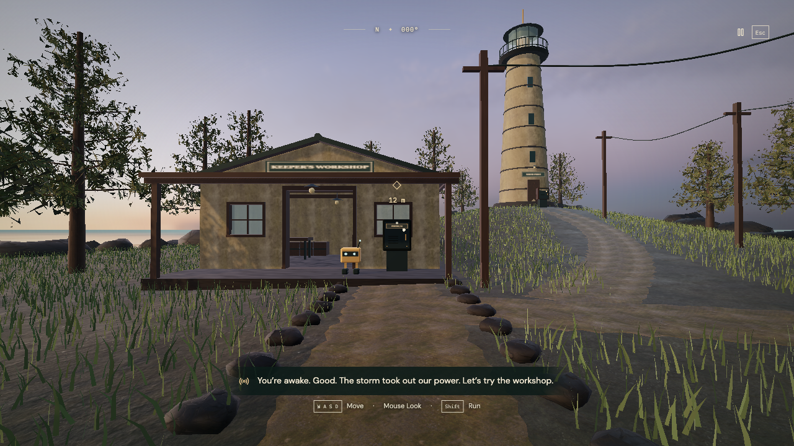

# SIGNAL — The Last Lighthouse

A first-person island puzzle adventure. Walk the coastal paths, find broken power cabinets, and repair their circuits to bring the workshop, harbor, and lighthouse back to life.



## Play

Requires Node.js 24 or newer.

```sh
npm install
npm run dev
```

Open **http://127.0.0.1:5174**. One command runs the game and local server. All three repairs work without an account or AI key. Art, textures, and fonts are bundled locally.

| Action                    | Control                                           |
| ------------------------- | ------------------------------------------------- |
| Walk                      | W A S D; ↑ / ↓ also move forward / back           |
| Look                      | Mouse; ← / → turn; Page Up / Down look vertically |
| Run                       | Shift                                             |
| Open a nearby cabinet     | E, while looking at it                            |
| Pause / release the mouse | Esc or Tab                                        |
| Map / field notes         | M / J                                             |
| Fullscreen                | F, or the title/pause menu control                |
| Connect a wire            | Select two sockets, or drag between them          |
| Remove a wire             | Select the cable, or connect the same pair again  |
| Cancel a connection       | Esc                                               |
| Close a circuit panel     | Esc again, or the close control                   |

On touch screens, use the left thumbstick to walk, drag the world to look, and tap the nearby cabinet prompt. Landscape is recommended for phone play. If pointer lock is unavailable, hold and drag to look. Keyboard navigation also works without pointer lock. Sound, camera motion, sensitivity, fullscreen, and a return-to-path option live in the pause menu.

The game uses a fixed **16:9 frame**, authored at 1280 × 720 and scaled to fit the display, with letterboxing on other aspect ratios. Every menu fits that frame with **no scrollbars**. Fullscreen is available before entering the island and throughout play. Paper menus have scanned grain, irregular torn edges, dark ink, and circuit annotations inspired by an early electrical notebook.

A compass, reticle, next-repair marker, and contextual interaction prompt guide exploration. The map and notebook appear only when opened. Menus use clear headings and controls without decorative captions, chapter labels, or persistent objective text. The workshop teaches the first connection, bridge material, prediction, and test one action at a time; guidance can be skipped.

## The adventure

1. **Workshop:** Complete a conducting loop and compare bridge materials.
2. **Harbor:** Repair two lamps in series, then observe what happens when one is disconnected.
3. **Lighthouse:** Build an independent backup path so B stays lit when A is removed.

Repairs change the actual lights in the world. Completing the lighthouse activates its rotating beam. After the ending, keep exploring; revisit the lighthouse cabinet to try a fresh circuit. Practice preserves the original discoveries.

Position, orientation, repairs, predictions, experiments, and notes save on this device. Reloading returns to the Continue screen, then resumes exploration where you left off. Reopen a cabinet to continue its unfinished circuit. Existing circuit saves remain compatible. Reset requires an explicit choice in Settings. If storage is blocked, play continues in the current tab. If WebGL is unavailable, the game explicitly offers circuit mode.

This is a playable three-repair prototype: a bounded island with procedural architecture, terrain collisions, photographed material textures, instanced vegetation, reflective water, and synthesized audio. It is not a production AAA game or an open-world campaign.

## Circuit controls and loading

**Reset** removes the wires you added; installed experiment wires remain. Select a cable to remove it individually. Circuit activities have no Undo, Hint, or Ask Pip controls and make no coaching requests. The current experiment instruction remains beside the board.

Paper, fonts, circuit textures, and all three kits prepare during the title screen. A single circuit renderer survives closing and reopening cabinets. If circuit graphics cannot prepare, the accessible SVG board remains available without switching appearance later. The paused world and idle circuit stop drawing until their visible state changes.

## Verify

```sh
npm test
npm run test:browser
npm run build
npm start
```

Browser tests use port 5175 and require Playwright Chromium (`npx playwright install chromium`). They cover an actual walk between all three cabinets, incorrect circuits, repairs, saving, keyboard controls, touch input, accessible circuit/notes dialogs, letterboxing, fullscreen, delayed textures, and renderer reuse. Unit checks also raycast the workshop’s gables, roof, floor, and openings and verify walking collision.

For screenshots and a local frame-time sample, run `node scripts/visual-review.mjs` while the development server is running. Results go to `docs/screenshots/fps-*` and `docs/render-check.json`. See [verification](docs/verification.md), [design](docs/design.md), and [architecture](docs/architecture.md).

Run `node scripts/workshop-review.mjs` for seven house views and three measured circuit openings. It writes `docs/screenshots/workshop-*` and `docs/workshop-review.json` and uses separate browser saves.

## Source

- `src/scene/navigation.ts`: terrain height, walking, collision, proximity, and camera saves.
- `src/scene/island.ts`: the explorable island, physical cabinets, vegetation, and power lights.
- `src/scene/workshop.ts`, `src/scene/workshopLayout.ts`: closed workshop shell, openings, joinery, and shared floor/collision dimensions.
- `src/scene/renderWorld.ts`: first-person camera, pointer lock, keyboard input, rendering, and restoration effects.
- `src/World.tsx`: minimal HUD, interaction prompt, and touch thumbstick.
- `src/App.tsx`, `src/game.css`: title/pause states and the game interface.
- `src/GameViewport.tsx`, `src/viewport.ts`, `src/Dialog.tsx`: shared 16:9 frame, render density, and modal game screens.
- `src/Workbench.tsx`, `src/CircuitBoard.tsx`, `src/BenchScene.tsx`: focused circuit inspection and accessible wiring controls.
- `src/circuit.ts`, `src/game.ts`, `src/missions.ts`: simulation, progression, and learning evidence.
- `server/`: local server; the retained coaching API has no controls in the game.

Built with React, TypeScript, Three.js, and Vite. Geometry and audio are authored in the source. Poly Haven textures/foliage are CC0; water normals come from Three.js. The paper map and torn paper texture were generated with the built-in image tool. Sources are recorded in `public/art/credits.json`, [paper UI and generation prompt](docs/paper-game-ui.md), and `docs/journal-art.md`. Fonts are bundled through Fontsource with their licenses.
