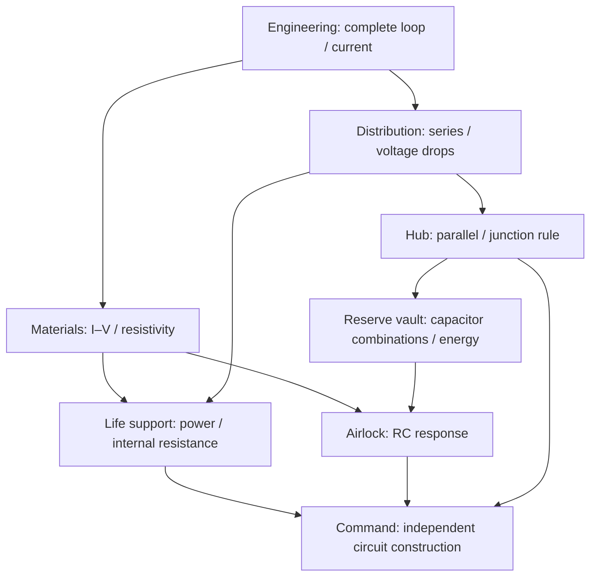
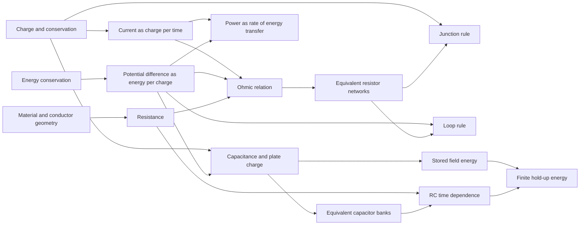

> Curriculum research retained from the earlier eight-system campaign. The active game now uses six introductory DC chambers; see [the current design](../chambers.md). Advanced investigations described here are not currently presented in the UI.

# Asterion: an exploratory circuits lesson

## Design decision

The station is a connected maintenance deck. Emergency lighting is the introductory repair; after it, materials and distribution can be investigated in either order. Resistance and series reasoning meet at life support. Distribution leads to independent branches, then capacitor storage. Stored energy and resistance meet at airlock hold-up. These systems converge at communications. No hypothesis or multiple-choice explanation is required to test or commission working equipment.

The research supports the design principles below, not a claim that this particular game improves exam scores. An observed student study is still required.

## Curriculum scope and knowledge graph

The current College Board framework places electric circuits in Unit 11, topics 11.1–11.8. It includes current, simple circuits, resistance/resistivity/Ohm's law, power, compound DC circuits, Kirchhoff's loop and junction rules, and RC circuits. The RC boundary is qualitative descriptions and representations; algebraic reasoning about RC is appropriate, but solving exponential responses is not a player requirement. Capacitor geometry and energy connect to preceding electrostatics content. [^1]

This is a prerequisite graph for commissioning equipment, not a locked walking route. The world contains two circulation loops, a central hub, a transverse service connection, and a forward observation deck. Players can inspect later equipment before it can be commissioned. The map lets them choose a currently available objective. The first bulkhead supplies the one introductory physical boundary; later dependencies describe upstream systems, not arbitrary keys.

## Concept-level dependency model

The room graph is deliberately simpler than the underlying knowledge graph. Charge conservation supports continuity of current in a series path and balance at a junction. Energy conservation supports potential difference as energy transferred per unit charge, then Kirchhoff's loop rule. A current is a rate, a voltage is an energy-per-charge difference, and resistance links the two under the ohmic model; the interface must not collapse them into a generic “power” indicator.

The first interaction supplies most wiring and cues the remaining connection. The series investigation supplies the route but removes a component so the dependency becomes visible. The sensor panel supplies manipulable apparatus, not a target answer button: measured current follows geometry and voltage. The pump removes the supplied resistance choice, requiring a value compatible with the source and load. The final wiring board supplies terminals without wires. This is the intended fading of support; the player can always return to the earlier equipment and recorded evidence.

Graph links are useful diagnostic hypotheses. A player who expects current to be consumed in a series component may need the charge-conservation link, not more practice substituting into V = IR. A player who adds series capacitances may be carrying over the resistor-network rule without attending to equal plate charge and divided voltage. A player who expects a charged capacitor to supply constant voltage indefinitely may need the stored-energy and changing-voltage links, not a larger capacitor preset.

Completion is evidence of successful equipment operation. It is not evidence by itself that a learner can explain the governing relation, transfer it to an unseen diagram, or estimate experimental uncertainty. Automatic measurements are deterministic and idealized; repeated tests do not manufacture measurement noise. A classroom follow-up should compare these ideal results with a physical circuit, instrument resolution and repeated measurements. The final free-wiring task provides one transfer opportunity, but it does not assess every AP science practice. These limits are reasons to pilot and revise the learning design, not to restore mandatory hypothesis forms.

## Why the old interaction failed

The previous interaction made an action button depend on a prediction selection and then made completion depend on an explanation selection. It conflated a teaching technique with a permission mechanism. A player who understood the repair still had to decode the form. Here, Test always acts immediately. Safe failures report the measured condition. A successful experiment enables a clearly named commissioning action. Comparison requirements are explicit before experimentation and refer to operations on equipment.

Implicit scaffolding uses affordances, constraints, cues and feedback to guide exploration while preserving control. The PhET framework supports limiting the initially visible decision space, making manipulable controls salient, and embedding guidance in responses. It does not imply that every learner succeeds without support. [^2] Research on engaged exploration distinguishes productive, lightly guided activity from both recipe following and unrestricted discovery. The cited study used college students and simulations, so transfer to a high-school first-person game is an implementation hypothesis. [^3]

The University of Washington circuits tutorial develops a model through observations and reasoning about current and resistance. That motivates the sequence from a complete route to comparisons between routes, before a final construction task. It is a design interpretation, not an adaptation of the tutorial's copyrighted worksheet. [^4]

## Repair specifications

| Equipment          | Player action                                       | Evidence and completion                                                          | Persistent consequence                         |
| ------------------ | --------------------------------------------------- | -------------------------------------------------------------------------------- | ---------------------------------------------- |
| Emergency lighting | Join a missing return; compare inserts              | Test a complete conducting loop                                                  | Engineering lighting and hub access            |
| Sensor feed        | Change material, length, area and voltage           | Record two voltages with the same conducting specimen; obtain 0.45–0.55 A at 6 V | Sensor indicators and workshop power           |
| Series interlock   | Reconnect the supplied route; remove A              | Observe two operating loads, then the shared failure                             | Distribution indicators and branch diagnostics |
| Pump controller    | Choose ballast for a nonideal source                | Load reads 5.9–6.1 V; instruments display losses                                 | Ventilation machinery starts                   |
| Independent supply | Compare network layouts; open A                     | Record both loads at 12 V; B retains 12 V after isolation                        | Hub reserve indicators                         |
| Capacitor bank     | Compare series and parallel modules                 | Compare both arrangements; store at least 2.5 J without exceeding module voltage | Reserve vault power                            |
| Airlock hold-up    | Charge; disconnect source; inspect time trace       | Start at ≥10.8 V; retain ≥6 V after 2 simulated seconds                          | Airlock control and reserve readiness          |
| Communications     | Construct independent routes without supplied wires | Both loads run; backup survives isolation                                        | Transmitter and rescue sequence                |

All equipment ratings and thresholds in this table are **Starting values**, chosen for legible comparisons and exact diagnostic cases. They are not specifications for real spacecraft or claims about classroom pacing. Microtest: a new player should describe each requirement and identify the next control without opening documentation; an experienced player should be able to reproduce a valid repair from the displayed ratings. Fail if either participant cannot identify why a test did not qualify. First adjust labels, graph scales and feedback; only then widen tolerances or simplify control options.

## Misconceptions and instructional responses

Current is not consumed in a component. The same-series-current display accompanies different voltage drops and powers. A source transfers energy, rather than supplying a fixed current regardless of load. The junction instrument separately displays branch and source currents. An open route differs from a short; the low-current specimen rig opens a virtual fuse on excessive demand, reports it, and allows immediate retesting after edits.

Resistance depends on both material and geometry: R = ρL/A. A length change is distinguished from a cross-sectional area change, with units visible. The specimen model holds temperature fixed and treats the resistive alloy as ohmic. Actual materials can change resistance with temperature, and real lamps and motors are not ideal fixed resistors. [^5] The equipment therefore identifies its loads as resistive test models.

A nonideal source has internal resistance. Its terminal voltage decreases with current because part of the emf is dropped internally. [^6] The pump investigation displays source emf, terminal voltage, internal drop, ballast drop and load voltage together, so the energy account remains inspectable.

Capacitor plate charge is a magnitude, with opposite signs on the two plates. Series capacitors share charge, while parallel capacitors share voltage; the equivalent-capacitance rules differ from resistor rules. [^7] Energy is stored in the electric field, and scales with capacitance and the square of voltage. [^8] The bank screen displays plate signs and voltage division rather than depicting charge traveling through the dielectric.

RC response is continuous, tends toward a steady state, and depends on both R and C. Exact exponential evaluation is used internally so changing rendering cadence cannot change the physics. The player sees a voltage/time graph, current direction and a marked time constant. [^9] The 2025 AP chief reader report specifically identifies confusion between instantaneous current and accumulated charge in an RC circuit. Therefore the interface never presents instantaneous I multiplied by elapsed time as capacitor charge; it uses Q = CV at that instant. [^10]

## State and interruption rules

| System        | Entry                                        | Exit / interruption                       | Persistence and edge behavior                                            |
| ------------- | -------------------------------------------- | ----------------------------------------- | ------------------------------------------------------------------------ |
| Walking       | Start, close equipment, resume               | Menu, equipment, browser blur             | Pose saved; movement cleared on pause; no resources consumed             |
| Bench editing | Open or revise                               | Test, close, reset                        | Edits invalidate the current result; earlier comparisons remain          |
| DC test       | Any build configuration                      | Immediate measured result                 | Bad circuits remain editable; no score penalty or hypothesis gate        |
| Charging      | Charge or advance to 5τ                      | Pause, edit, close, discharge             | Model time advances only while the panel is open and visible             |
| Outage test   | Disconnect at any charge                     | Two simulated seconds, pause, edit, close | Start voltage retained; completion recomputed from R, C and elapsed time |
| Commissioning | Valid measured evidence and upstream repairs | Explicit restore button                   | Persistent system transition; repeat inspection is available             |
| Transmission  | All eight systems commissioned               | ACK timer or reset                        | Closing console does not cancel sending; reset cancels it                |

No death timer, consumable inventory or combat competes with the experiments. Motion reduction preserves the same measured states. Comparisons and source settings are recorded automatically; written notes are optional.

## Five-component evaluation

**Clarity:** one equipment fault, one visible target and measured failure explanations. DC testing is immediate. **Motivation:** every verified repair changes an identifiable station subsystem. **Response:** editing and retrying remain available; menus and RC playback are interruptible. **Satisfaction:** instrument changes, restoration lighting and equipment sounds confirm the same state transition. **Fit:** controls look like maintenance instruments and solve a fault located in the surrounding room.

Priority is response, clarity, satisfaction, fit, then motivation, following the supplied game-design framework. Mandatory reflection forms were removed before adding visual effects.

## Art direction and performance

Alien: Isolation's UI designer describes an analog video and flight-recorder foundation for its interface. [^11] The direction here interprets that through inset phosphor displays, mechanical controls, aged finishes, a restricted palette, physical signage and distinct compartment functions. It does not reproduce franchise assets, branding, layouts or claims of equivalent production quality.

Authored modular pressure walls use a repeatable structural rhythm, bevels, recessed panels and protected cable runs. Short names at major doorways provide wayfinding. Engineering is warm, materials is neutral, life support uses desaturated green, and the reserve area uses cool instrument light. A central machine blocks the full route view and acts as an orientation landmark. Doors frame changing views. Windows in the working compartments establish the station's setting early, while Command's three-sided observation gallery supplies a broader destination view.

### Doorways and exterior views

Door construction reserves space for the frame before ceiling services are placed. Header, leaf, kickplate and stripe surfaces are separated geometrically. Wall stiffeners are inset from exposed shell ends. This removes the measured coplanar faces and the light/pipe intersections at the introductory bulkhead without changing depth-buffer settings or drawing trim over the top of other objects.

**Starting values:** the closed door has a 20 mm centre seam, 30 mm side clearances, 40 mm clearance below its header, and 16 mm above the threshold. Wall stiffeners stop 30 mm inside the shell's end faces. Microtest: inspect both doorway approaches at standing eye height and sweep the door through closed, partial and fully open states. Fail if visible parallel faces lie within 0.5 mm along the sampled sight lines, trim flickers while turning, or the moving leaf catches a player. Adjust the geometry at the intersection and recheck the actual movement route. Do not use a global polygon offset to conceal overlapping assemblies.

Nine window banks contain 32 panes. The glass is recessed behind a structural frame; sill and head infills leave real openings in the hull mesh. Materials has a view above its workbench; Engineering cylinders and Distribution racks sit against the aft walls to clear their side windows; Command wraps windows around three sides. Neighbouring station compartments and instanced solar wings create foreground depth. Shared Earth, Moon, Saturn and star-field textures from Solar System Scope replace the procedural striped exterior. [^13]

**Starting values:** window banks span 6–12 m in 2 m bays, with most sills at 1.05 m; glass opacity is 0.035. Space maps are limited to 2K, anisotropy to 2, and solar cells to one instanced draw. The celestial positions and apparent sizes are art-directed, not astronomically scaled. Microtest: walk from Engineering through either wing to Command, approach every bank and turn obliquely. Pass if the exterior stays continuous, openings are clear of opaque hull faces, nearby structure provides parallax, and collisions stop the player at the hull. Fail if the glass washes out the view, a ceiling support masks a window, or added detail degrades the comparable frame sample. Adjust sill/head clearance and view composition first, then texture/detail budget; preserve repair affordances and the quiet world text policy.

For this visual follow-up, **Response** means retaining the existing movement, door interruption rules and frame budget. **Clarity** means physically readable openings and keeping the same six doorway names. **Satisfaction** and **Fit** come from consistent planetary views, foreground depth and solid door assemblies. **Motivation** remains tied to restoring equipment. The windows introduce no new controls, text prompts or completion gates.

ASSUMPTION: exterior views help establish place without distracting from the initial repair. IMPACT: the station feels like a physical location before the first experiment. IF WRONG: the player scans the windows for interactions instead of approaching equipment. VALIDATE: observe a first-time player finding the Engineering console and choosing a wing; adjust equipment contrast or sight lines if the exterior obscures that action.

### Exploration information hierarchy

The world should invite movement before reading. The previous presentation repeated equipment identity across a floor stencil, cabinet header, status screen, room sign and objective paragraph. The current world removes all 17 floor labels, every cabinet banner, the repeated room placards and decorative text plates. Only six short doorway names remain. Serviceable equipment retains its physical silhouette and an inset display with an amber wrench, dim pause mark or steady green tick. Shape accompanies color. Other screens show quiet, static waveforms or orbital graphics without captions; these are ambient instruments, not simulated experimental measurements.

While walking, the HUD gives the current compartment, a compact equipment objective and its destination. A proximity prompt identifies the available interaction. The repair panel contains the fault, numerical target and instructional guidance; the map and optional Q diagnostics contain the broader network. The introductory message supplies only the immediate action. No instruction has to be read from the floor or decoded from several overlapping signs.

**Starting values:** doorway lettering occupies a 1.95 × 0.15 m area; the compact objective uses a 14 px heading within a 220 px width at the authored viewport. Microtest: a novice should find the initial console and identify either wing from the hub without stopping to scan several text panels. Fail if a doorway name cannot be read on approach, a service console is mistaken for decoration, or the objective disappears against a bright fixture. Adjust local contrast, cabinet affordance or doorway lettering first; keep the floor and distant cabinet skyline free of text. Stress and skill cases retain the existing proximity, map, keyboard, touch and transmission checks. Inspect both an unpowered and restored room so brighter lighting does not compromise readability.

A locally served 1K PBR metal material comes from Poly Haven under CC0. [^12] Three maps supply color, surface normals and roughness. Only runtime maps are retained. Geometry is authored at fixed coordinates; no randomized room generation or AI-generated illustration is used.

**Starting values:** retain the existing 68° field of view, 3.5 m/s walk, 6 m/s run and pixel-ratio caps. Use material batching, cached shadows, limited nearby lights, and no new full-screen postprocess. Microtest: compare the same 1280×720 stationary and moving routes to the previous local 16.7 ms median frame interval, then inspect spikes during commissioning. Fail if p90 or median degrades materially on the same browser/hardware; reduce distant lighting, shadow work or optional surface detail before reducing legibility. This is a local comparison, not a minimum-spec performance guarantee.

## Critical assumptions

ASSUMPTION: learners know charge and basic potential before the capacitor branch. IMPACT: capacitor energy can be connected to earlier ideas. IF WRONG: symbols become unexplained instructions. VALIDATE: ask learners to explain the + and − plates and what 12 V describes before the bank task; add an optional preceding electrostatics activity if needed.

ASSUMPTION: choosing between two wings adds useful agency without disorientation. IMPACT: the station feels explored rather than paged through. IF WRONG: walking becomes searching. VALIDATE: after the first repair, ask for the two available destinations and observe whether the map and wall signs are sufficient.

ASSUMPTION: a desktop browser can sustain the existing rendering budget for the larger deck. IMPACT: authored detail can replace open, flat rooms. IF WRONG: use stricter spatial batching/culling and fewer simultaneous lights. VALIDATE: repeat local runtime measurements and check a representative integrated-GPU laptop; the latter cannot be claimed from desktop measurements.

## Playtest scripts

**New player:** begin without a briefing; make a conducting loop; choose a wing; explain a failed test from its instruments. Record hesitations without intervening. **Stress:** rapidly change sample settings, test repeatedly, pause RC playback, switch panels, hide the tab, reload and resume. Values must stay finite and no time may advance invisibly. **Skill:** choose a valid ballast using the emf and internal resistance; predict and then inspect a changed branch load; obtain a hold-up bank without exhaustive guessing. **Abuse:** attempt commissioning with missing evidence, stale results, corrupted saved values, a short circuit, or missing upstream repairs. The reducer must reject it. **Observer readability:** an observer should identify which control changed, which reading responded and which station subsystem came online.

A later class pilot should use a short unseen-circuit pre/post assessment plus delayed transfer, recording misconceptions and strategy rather than only completion time. There is no measured learning-gain claim for the current build.

## Sources

[^1]: College Board. [AP Physics 2 Course and Exam Description](https://apcentral.collegeboard.org/media/pdf/ap-physics-2-course-and-exam-description.pdf), current 2026 revision, Unit 11 and its boundary statements.

[^2]: Podolefsky, Moore and Perkins. [Implicit scaffolding in interactive simulations: Design strategies to support multiple educational goals](https://arxiv.org/pdf/1306.6544), 2013.

[^3]: Podolefsky, Perkins and Adams. [Factors promoting engaged exploration with computer simulations](https://phet.colorado.edu/publications/prst-per-2010.pdf), Physical Review ST Physics Education Research 6, 020117, 2010.

[^4]: University of Washington Physics Education Group / PhysPort. [A model for circuits, Part 1: Current and resistance](https://www.physport.org/curricula/UWTutorials/t/tutorial.cfm?G=CK11st), curriculum description and research bibliography.

[^5]: OpenStax. [Resistivity and Resistance](https://openstax.org/books/university-physics-volume-2/pages/9-3-resistivity-and-resistance), University Physics Volume 2, 2016.

[^6]: OpenStax. [Electromotive Force](https://openstax.org/books/university-physics-volume-2/pages/10-1-electromotive-force), University Physics Volume 2.

[^7]: OpenStax. [Capacitors in Series and in Parallel](https://openstax.org/books/university-physics-volume-2/pages/8-2-capacitors-in-series-and-in-parallel), University Physics Volume 2.

[^8]: OpenStax. [Energy Stored in a Capacitor](https://openstax.org/books/university-physics-volume-2/pages/8-3-energy-stored-in-a-capacitor), University Physics Volume 2.

[^9]: OpenStax. [RC Circuits](https://openstax.org/books/university-physics-volume-2/pages/10-5-rc-circuits), University Physics Volume 2. Exponentials used for simulation, not required player calculations.

[^10]: College Board. [2025 AP Physics 2 Chief Reader Report](https://apcentral.collegeboard.org/media/pdf/ap25-cr-report-physics-2.pdf), Question 3.

[^11]: Art of the Title. [Alien: Isolation](https://www.artofthetitle.com/title/alien-isolation/), interview with UI lead Jon McKellan, 2014.

[^12]: Poly Haven. [Metal Plate](https://polyhaven.com/a/metal_plate), [CC0 license](https://polyhaven.com/license). Local 1K color, OpenGL normal and roughness maps.

[^13]: Solar System Scope. [Solar System Textures](https://www.solarsystemscope.com/textures/), [CC BY 4.0](https://creativecommons.org/licenses/by/4.0/). Published 2K maps use NASA imagery and other data with artistic adjustments. Exact retained files and attribution are in [asset provenance](../assets.md).
